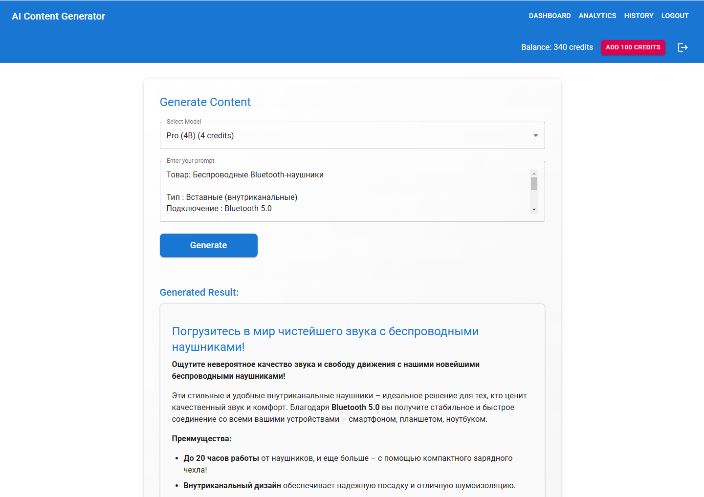
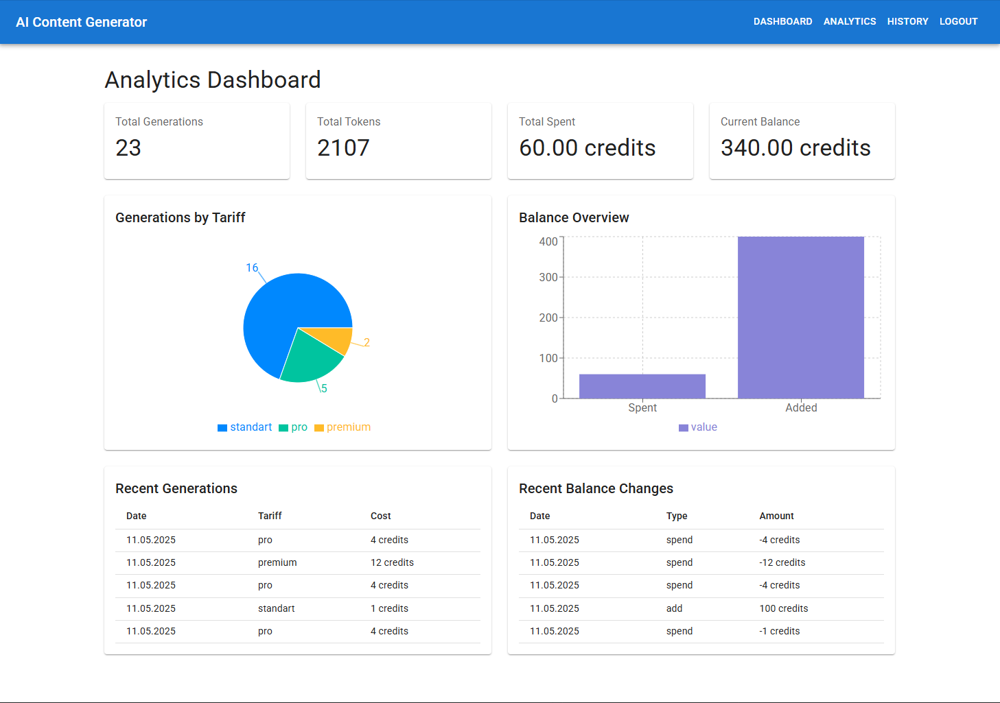
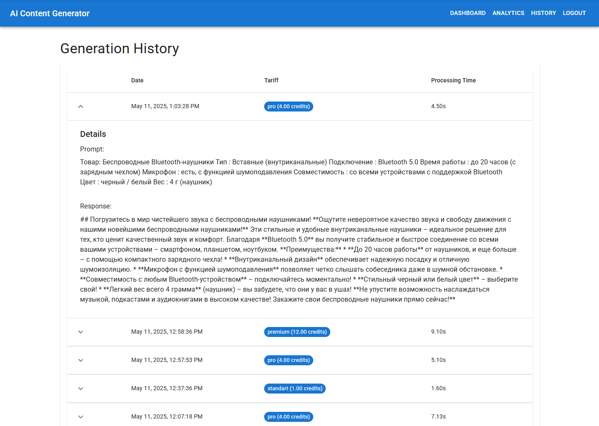

# AI Content Generator

A full-stack web application that generates AI-powered content using different language models. The application features user authentication, credit-based content generation, and a modern React frontend.







## Features

- 🔐 User authentication (register/login)
- 💰 Credit-based system for content generation
- 🤖 Multiple AI models with different capabilities:
  - Standard (1B parameters)
  - Pro (4B parameters)
  - Premium (12B parameters)
- 📝 Markdown support for generated content
- 💳 Balance management system
- 🎨 Modern Material-UI interface
- 🔒 Secure token-based authentication
- 🐳 Docker support for easy deployment

## Tech Stack

### Backend
- FastAPI (Python web framework)
- SQLAlchemy (ORM)
- JWT for authentication
- Ollama for AI model integration
- SQLite database

### Frontend
- React
- Material-UI
- React Router
- Axios for API calls
- React Markdown for content rendering

## Prerequisites

- Python 3.9+
- Node.js 14+
- Docker and Docker Compose (for containerized deployment)
- NVIDIA GPU (recommended for better performance)

## Installation

### Using Docker (Recommended)

1. Clone the repository:
```bash
git clone <repository-url>
cd ai-content-generator
```

2. Build and start the containers:
```bash
docker-compose up --build
```

The application will be available at:
- Frontend: http://localhost:3000
- Backend: http://localhost:8000
- API Documentation: http://localhost:8000/docs

### Manual Installation

#### Backend Setup

1. Create a virtual environment:
```bash
python -m venv venv
source venv/bin/activate  # On Windows: venv\Scripts\activate
```

2. Install dependencies:
```bash
pip install -r requirements.txt
```

3. Start the backend server:
```bash
uvicorn app.main:app --reload
```

#### Frontend Setup

1. Navigate to the frontend directory:
```bash
cd frontend
```

2. Install dependencies:
```bash
npm install
```

3. Start the development server:
```bash
npm start
```

## Usage

1. Register a new account or login with existing credentials
2. Add credits to your balance using the "Add 100 Credits" button
3. Select a model/tariff from the dropdown menu
4. Enter your prompt in the text area
5. Click "Generate" to create content
6. The generated content will be displayed with Markdown formatting

## API Endpoints

- `POST /register` - Register a new user
- `POST /token` - Login and get access token
- `GET /balance` - Check current balance
- `POST /balance` - Add credits to balance
- `POST /generate` - Generate content with selected model

## Environment Variables

### Backend
- `DATABASE_URL` - Database connection string
- `OLLAMA_HOST` - Ollama service host URL
- `SECRET_KEY` - JWT secret key
- `ALGORITHM` - JWT algorithm

### Frontend
- `REACT_APP_API_URL` - Backend API URL

## Contributing

1. Fork the repository
2. Create a feature branch
3. Commit your changes
4. Push to the branch
5. Create a Pull Request

## License

This project is licensed under the MIT License - see the LICENSE file for details.

## Acknowledgments

- [FastAPI](https://fastapi.tiangolo.com/)
- [React](https://reactjs.org/)
- [Material-UI](https://mui.com/)
- [Ollama](https://ollama.ai/) 